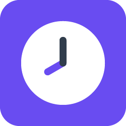
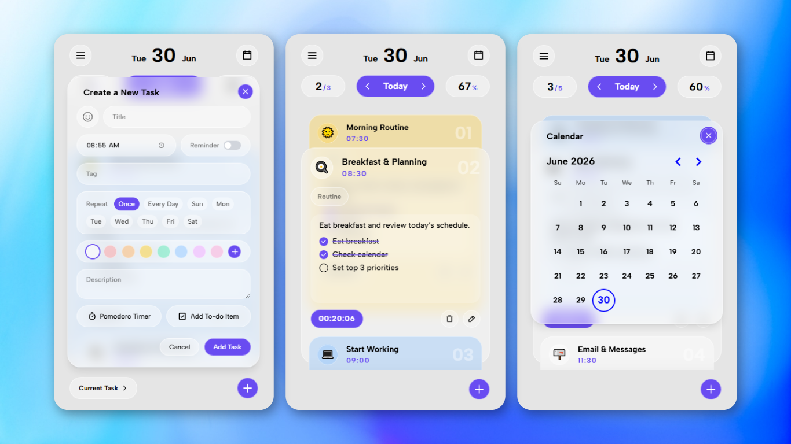

<div align="center">


# WhatsWhen?

A free and open-source daily planner and task manager web application.

[![OPEN]](https://whatswhen.netlify.app/)

[![LICENSE]](https://github.com/BehnamAzg/WhatsWhen/blob/main/LICENSE) [![VERSIOIN]](https://github.com/BehnamAzg/WhatsWhen/releases) [![STARS]](https://github.com/BehnamAzg/WhatsWhen) [![SUPPORT]](https://behnamazg.github.io/Donation)
</div>




## ℹ️ About

WhatsWhen is built with React. It is a client-side application, meaning your data is never sent to any server.
Application data is stored locally in your browser using the native IndexedDB API.

## ✔️ Features

- Task timer between tasks
- Task reminders
- Task customization
- Todo lists
- Pomodoro timer
- PWA installable
- Offline support

## 📑 Documentation

### 🔹 Persistent Storage

By default, browsers operate in **"best effort" storage mode**. This is the default storage state per origin in most browsers. Its behavior may vary depending on the browser, operating system, and conditions such as private/incognito mode.

In general, data stored in this mode may be cleared by the browser after a period of inactivity or under storage pressure.

> [!WARNING]
> To make your data persistent and less likely to be cleared, you should enable **persistent storage**. This can be done simply by installing the web app.

> [!TIP]
> To also make sure **persistent storage** is activated, you can run this command in the console:
>
> ```js
> await navigator.storage.persist()
> ```
>
> [Read more](https://developer.mozilla.org/en-US/docs/Web/API/Storage_API/Storage_quotas_and_eviction_criteria)

### 🔹 Export and Importing Data

This app uses the **IndexedDB Web API** to store your data locally.

You will be able to export and import your data as a JSON file.  
(This feature is not available in the current version yet.)


[OPEN]: https://img.shields.io/badge/Open_WhatsWhen_➜-694cf1?style=for-the-badge
[LICENSE]: https://img.shields.io/github/license/BehnamAzg/WhatsWhen?style=flat
[VERSIOIN]: https://img.shields.io/github/v/release/BehnamAzg/WhatsWhen?style=flat
[STARS]: https://img.shields.io/github/stars/BehnamAzg/WhatsWhen?style=flat
[SUPPORT]: https://img.shields.io/badge/Support-🤍-694cf1?style=flat&labelColor=694cf1
